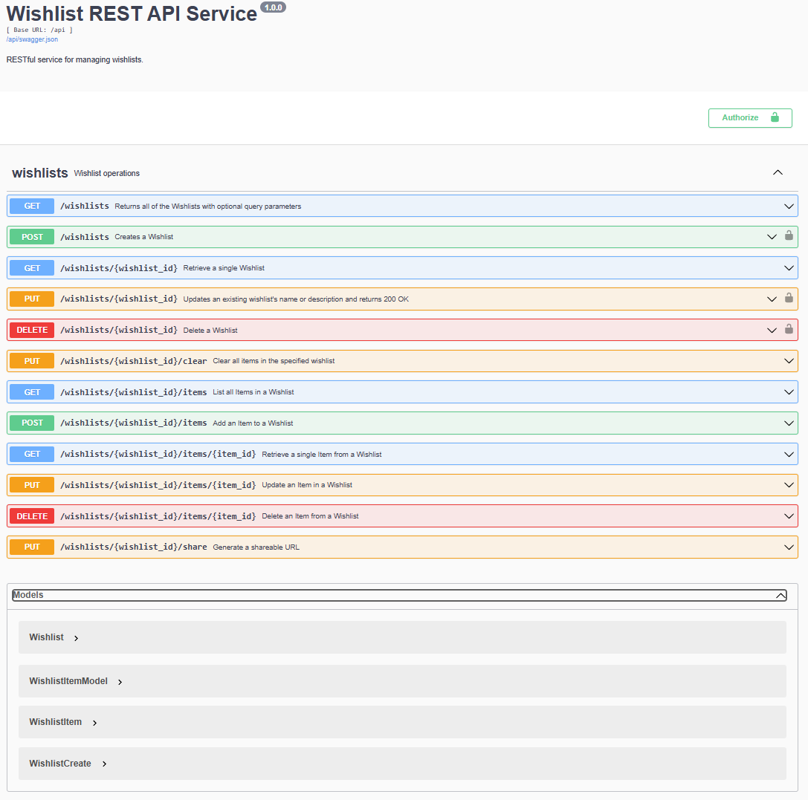

# RESTful API Service for Wishlists

[](https://opensource.org/licenses/Apache-2.0)
[](https://python.org/)
[](https://github.com/CSCI-GA-2820-FA25-003/wishlists/actions)
[](https://codecov.io/gh/CSCI-GA-2820-FA25-003/wishlists)


This is a documentation for API usage on Wishlists.

## Service Overview

This is a Flask-based RESTful API for managing customer **wishlists** and their items. It supports basic CRUD operations for wishlists and nested CRUD operations for items.

## Prerequisites

It is recommended to run this project in a Dev Container for consistent dependencies.

Make sure you have installed:

* Docker

* VS Code

* Dev Containers extension

## Getting Started

Follow these steps to clone the repository, start the development environment, and run the API.

1. Clone the Repository
```
git clone https://github.com/CSCI-GA-2820-FA25-003/wishlists.git
cd wishlists
```

2. Open in VS Code and Reopen in Container
When ready, start the service:

```bash
honcho start
```

3. Deploying to Kubernetes

   This service can also be deployed locally to a Kubernetes cluster using the provided Makefile commands:

```bash
make cluster        # create a local k3d cluster
make build          # build the Docker image
make push           # push image to local registry
make deploy         # deploy all manifests under ./k8s
```

Service will run at http://localhost:8080/

## Accessing the API

### Swagger Documentation (Recommended)

The easiest way to explore and test the API is through the **Swagger UI** interface:

1. **Start the service** (if not already running):

   ```bash
   honcho start
   ```

2. **Open Swagger UI** in your browser:

   ```text
   http://localhost:8080/apidocs
   ```

   

### API Authentication

Some operations require authentication using an API key passed in the `X-Api-Key` header.

**Protected Endpoints** (require API key):

* `POST /api/wishlists` - Create a wishlist
* `PUT /api/wishlists/{id}` - Update a wishlist
* `DELETE /api/wishlists/{id}` - Delete a wishlist

**Getting Your API Key**:

* **Local Development**: The API key is stored in `apikey.txt` in the project root. **Note**: Running pytest will overwrite this file, so make sure to copy the key immediately after starting the service.
* **OpenShift Deployment**: Use the API key `dev-api-key-123`

## API Endpoint Reference

All REST API endpoints are prefixed with `/api`. The table below shows the available operations:

| **Method** | **Endpoint**                               | **Auth Required** | **Purpose / Description**                                         |
| :--------- | :----------------------------------------- | :--------------- | :---------------------------------------------------------------- |
| **GET** | `/` | No | Return the Admin UI (index.html) |
| **GET** | `/health` | No | Health check endpoint |
| **GET** | `/api-info` | No | Get service metadata and endpoint listing |
| **GET**    | `/api/wishlists`                               | No | Get a list of all wishlists (supports filtering)                         |
| **GET**    | `/api/wishlists/{wishlist_id}`                 | No | Get details of a specific wishlist                                |
| **POST**   | `/api/wishlists`                               | **Yes** | Create a new wishlist for a customer                              |
| **PUT**    | `/api/wishlists/{wishlist_id}`                 | **Yes** | Update the attributes (name, description) of an existing wishlist |
| **DELETE** | `/api/wishlists/{wishlist_id}`                 | **Yes** | Delete a wishlist                                                 |
| **GET**    | `/api/wishlists/{wishlist_id}/items`           | No | Get all items of a specific wishlist (supports filtering)                              |
| **GET**    | `/api/wishlists/{wishlist_id}/items/{item_id}` | No | Get one specific item from a wishlist                             |
| **POST**   | `/api/wishlists/{wishlist_id}/items`           | No | Add a new item to a wishlist                                      |
| **PUT**    | `/api/wishlists/{wishlist_id}/items/{item_id}` | No | Update details of an existing item                                |
| **DELETE** | `/api/wishlists/{wishlist_id}/items/{item_id}` | No | Remove an item from a wishlist                                    |
| **PUT**    | `/api/wishlists/{wishlist_id}/clear` | No | Clear all items from a wishlist  |  
| **PUT**    | `/api/wishlists/{wishlist_id}/share` | No | Share a wishlist |

## API Usage Examples

Below are example `curl` commands demonstrating common API operations. Replace `YOUR_API_KEY_HERE` with your actual API key for protected endpoints.

### Wishlist Operations

1. **Create a wishlist** (requires API key)

   ```bash
   curl -X POST http://localhost:8080/api/wishlists \
     -H "Content-Type: application/json" \
     -H "X-Api-Key: YOUR_API_KEY_HERE" \
     -d '{
       "customer_id": "CUST001",
       "name": "Holiday Gifts",
       "description": "Winter wishlist"
     }'
   ```

2. **Get all wishlists**

   ```bash
   curl -X GET http://localhost:8080/api/wishlists
   ```

3. **Get wishlists by customer**

   ```bash
   curl -X GET "http://localhost:8080/api/wishlists?customer_id=CUST001"
   ```

4. **Search wishlists by name**

   ```bash
   curl -X GET "http://localhost:8080/api/wishlists?customer_id=CUST001&name=Holiday"
   ```

5. **Get a specific wishlist**

   ```bash
   curl -X GET http://localhost:8080/api/wishlists/1
   ```

6. **Update a wishlist** (requires API key)

   ```bash
   curl -X PUT http://localhost:8080/api/wishlists/1 \
     -H "Content-Type: application/json" \
     -H "X-Api-Key: YOUR_API_KEY_HERE" \
     -H "X-Customer-Id: CUST001" \
     -d '{
       "name": "Holiday Gifts Updated",
       "description": "Updated wishlist for winter holidays"
     }'
   ```

7. **Delete a wishlist** (requires API key)

   ```bash
   curl -X DELETE http://localhost:8080/api/wishlists/1 \
     -H "X-Api-Key: YOUR_API_KEY_HERE"
   ```

8. **Clear all items from a wishlist**

   ```bash
   curl -X PUT http://localhost:8080/api/wishlists/1/clear
   ```

9. **Share a wishlist**

   ```bash
   curl -X PUT http://localhost:8080/api/wishlists/1/share
   ```

### Wishlist Item Operations

1. **Add an item to a wishlist**

   ```bash
   curl -X POST http://localhost:8080/api/wishlists/1/items \
     -H "Content-Type: application/json" \
     -d '{
       "product_id": 12345,
       "product_name": "Wireless Headphones",
       "prices": 79.99
     }'
   ```

2. **Get all items in a wishlist**

   ```bash
   curl -X GET http://localhost:8080/api/wishlists/1/items
   ```

3. **Filter items by product ID**

   ```bash
   curl -X GET "http://localhost:8080/api/wishlists/1/items?product_id=12345"
   ```

4. **Search items by product name**

   ```bash
   curl -X GET "http://localhost:8080/api/wishlists/1/items?product_name=Headphones"
   ```

5. **Get a specific item**

   ```bash
   curl -X GET http://localhost:8080/api/wishlists/1/items/2
   ```

6. **Update an item**

   ```bash
   curl -X PUT http://localhost:8080/api/wishlists/1/items/2 \
     -H "Content-Type: application/json" \
     -d '{
       "product_id": 12345,
       "product_name": "Wireless Headphones V2",
       "prices": 89.99
     }'
   ```

7. **Delete an item**

   ```bash
   curl -X DELETE http://localhost:8080/api/wishlists/1/items/2
   ```
## Testing Instructions

Run the tests by:

```
pytest -q
```

Expected coverage: ≥ 95%

## Behavior-Driven Development (BDD) Tests

We implemented an admin UI and corresponding BDD tests using **Behave** and **Selenium** to verify end-to-end functionality (Create, Read, Update, Delete, List, Query, and Action).

### Running BDD Tests

```bash
flask run
```

Then, in another terminal:

```bash
behave
```

## Development Workflow

1. Create a feature branch

```
git checkout -b feature/<task-name>
```

2. Commit and push changes

```
git add .
git commit -m "feat: <short description>"
git push origin feature/<task-name>
```

3. Open a Pull Request on GitHub

* Link the related issue (Issue #<number>)

* Wait for code review before merging and closing


## Troubleshooting 

| Problem                      | Likely Cause                | Solution                                  |
| ---------------------------- | --------------------------- | ----------------------------------------- |
| `415 Unsupported Type` | Missing JSON header         | Add `-H "Content-Type: application/json"` |
| `403 Forbidden`              | Wrong customer ID header    | Use correct `X-Customer-Id`               |
| `404 Not Found`              | Invalid wishlist or item ID | Check existing IDs via list endpoints     |


## Contents

The project contains the following:

```text
.
├── Dockerfile                - Docker build instructions
├── LICENSE                   - Apache 2.0 license
├── Makefile                  - Automation commands
├── Pipfile                   - Python dependencies for dev environment
├── Pipfile.lock              - Locked dependency versions
├── Procfile                  - Process definition for Honcho/Gunicorn
├── README.md                 - Project documentation
├── apikey.txt                - API key for local development
├── dot-env-example           - Example environment variable file
├── setup.cfg                 - Linting and formatting configuration
├── wsgi.py                   - WSGI entry point for Gunicorn
│
├── assets/                   - Documentation assets
│   └── swagger-ui-screenshot.png - Swagger UI interface screenshot
│
├── features/                 - BDD test scenarios and step definitions
│   ├── environment.py        - Behave environment setup
│   ├── item.feature          - BDD feature tests for wishlist items
│   ├── wishlist.feature      - BDD feature tests for wishlists
│   └── steps/
│       ├── item_steps.py     - Step definitions for item operations
│       ├── web_steps.py      - Browser UI interaction helpers
│       └── wishlist_steps.py - Step definitions for wishlist operations
│
├── k8s/                      - Kubernetes deployment manifests
│   ├── deployment.yaml       - App Deployment (Flask service)
│   ├── ingress.yaml          - Ingress route for external access
│   ├── service.yaml          - ClusterIP Service for Flask app
│   └── postgres/             - PostgreSQL StatefulSet & config files
│       ├── configmap.yaml
│       ├── pvc.yaml
│       ├── secret.yaml
│       ├── service.yaml
│       └── statefulset.yaml
│
├── service/                  - Flask application source code
│   ├── __init__.py
│   ├── config.py             - Application configuration
│   ├── routes.py             - API route definitions
│   ├── common/               - Shared utilities
│   │   ├── cli_commands.py   - CLI for DB initialization
│   │   ├── error_handlers.py - Error handling and HTTP codes
│   │   ├── log_handlers.py   - Logging setup
│   │   └── status.py         - HTTP status constants
│   ├── models/               - Data models and ORM logic
│   │   ├── persistent_base.py
│   │   ├── wishlist.py
│   │   └── item.py
│   └── static/               - Web UI files
│       ├── css/
│       ├── images/
│       ├── js/
│       └── index.html        - Admin UI for wishlists
│
└── tests/                    - Pytest unit and integration tests
    ├── factories.py          - Factory for generating test data
    ├── test_cli_commands.py  - CLI command tests
    ├── test_item.py          - Wishlist item model tests
    ├── test_routes.py        - API endpoint tests
    └── test_wishlist.py      - Wishlist model tests
```

## License

Copyright (c) 2016, 2025 [John Rofrano](https://www.linkedin.com/in/JohnRofrano/). All rights reserved.

Licensed under the Apache License. See [LICENSE](LICENSE)

This repository is part of the New York University (NYU) masters class: **CSCI-GA.2820-001 DevOps and Agile Methodologies** created and taught by [John Rofrano](https://cs.nyu.edu/~rofrano/), Adjunct Instructor, NYU Courant Institute, Graduate Division, Computer Science, and NYU Stern School of Business.
